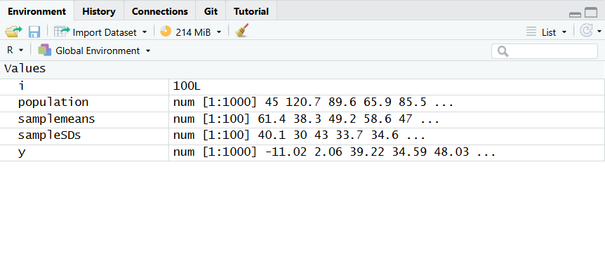

# Week3 Practical1 - Law of Large Numbers
As sample size increases, the sample mean and sample SD tend to get closer to the true population mean and SD.

The following code:
```R
population <- rnorm(1000, 52, 40)

samplemeans <- vector(length=100)
sampleSDs <- vector(length=100)

for(i in 1:100){
  y <- sample(population, i*10)

  samplemeans[i] <- mean(y)
  sampleSDs[i] <- sd(y)
}
```

The output:
