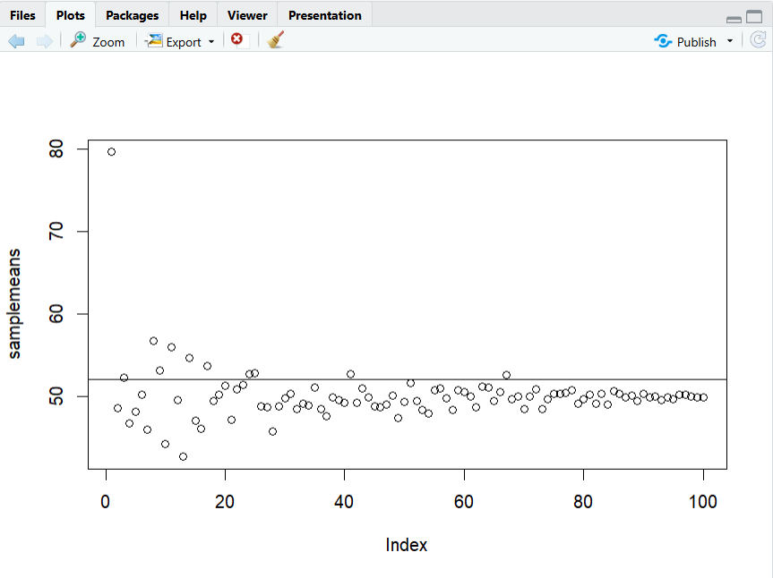
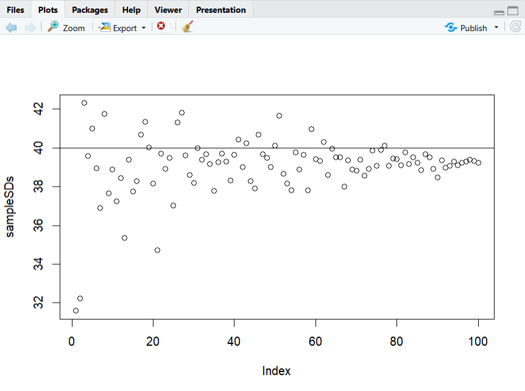

# Week3 Practical2 - Simulation and Power

For understanding power, sample size and effect size. It simulates 100 different studies and counts how many are statistically significant.

The following code:
```R
samplesize <- 200
meanX <- 50
meanY <- 51
sdX <- 5
sdY <- 5
pvalues <- vector(length = 100)

effectSize <- abs(meanX - meanY) / sqrt(((sdX*sdX) + (sdY*sdY)) / 2)

for(i in 1:100){
  x <- rnorm(samplesize, meanX, sdX)
  y <- rnorm(samplesize, meanY, sdY)
  p <- t.test(x, y, paired = FALSE)
  pvalues[i] <- p$p.value
}

hist(pvalues, breaks = 20)
length(pvalues[pvalues < 0.05])
```

The output:<br>


## Explanation of the code

1. The following line code:
```R
samplesize <- 200
```

Sets the number of observations in each group

2. The following line code:
```R
meanX <- 50
meanY <- 51
sdX <- 5
sdY <- 5
```

Defines the population means and standard deviations for the two groups being compared

3. The following line code:
```R
pvalues <- vector(length = 100)
```

Creates an empty vector to store the p-value from each of the 100 simulated studies

4. The following line code:
```R
effectSize <- abs(meanX - meanY) / sqrt(((sdX*sdX) + (sdY*sdY)) / 2)
```

Calculates Cohen’s d effect size for the difference between the two groups

5. The following line code:
```R
for(i in 1:100){
```

Starts a loop to simulate 100 separate studies

6. The following line code:
```R
x <- rnorm(samplesize, meanX, sdX)
y <- rnorm(samplesize, meanY, sdY)
```

Generates random samples for group X and group Y from their populations

7. The following line code:
```R
p <- t.test(x, y, paired = FALSE)
```

Runs an independent two-sample t-test on that simulated study

8. The following line code:
```R
pvalues[i] <- p$p.value
```

Starts a loop to simulate 100 separate studies

5. The following line code:
```R
for(i in 1:100){
```

Starts a loop to simulate 100 separate studies


## Plot 

Notice how  the sample mean is more akin to the population mean as the sample size increases 

The following code:
```R
plot(samplemeans)
abline(h = 52)

plot(sampleSDs)
abline(h = 40)
```

The output:<br>

